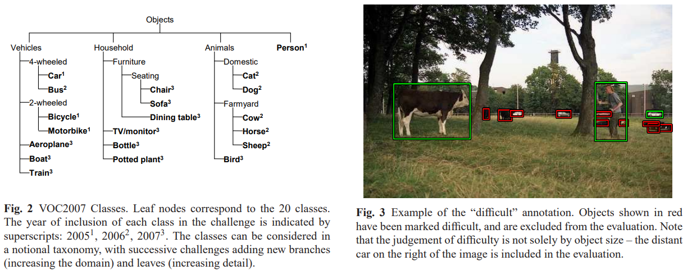
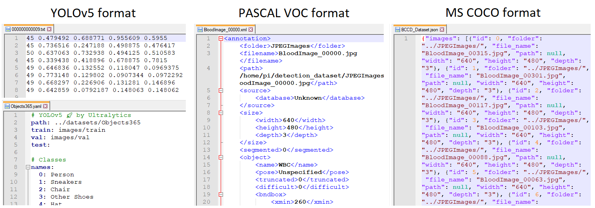

# Текст статьи

# MS COCO

Проблема разметки бокса и в целом задачи детекции
Метрика mAP50, mAP50:95

## PASCAL VOC

PASCAL VOC challenge ([Everingham et al., 2010](https://homepages.inf.ed.ac.uk/ckiw/postscript/ijcv_voc09.pdf), [Everingham et al., 2014](http://host.robots.ox.ac.uk/pascal/VOC/pubs/everingham15.pdf)) - соревнование по детекции объектов и семантической сегментации изображений, проходившее ежегодно с 2005 по 2012 год. Скачать данные и посмотреть отличия между версиями разных лет можно на странице [PASCAL VOC project](http://host.robots.ox.ac.uk/pascal/VOC/). Две основные версии датасета - 2007 и 2012 годов.

| Версия          | Train+val size | Test size | N classes |
|-----------------|----------------|-----------|-----------|
| PASCAL VOC 2007 | 2501           | 4952      | 20        |
| PASCAL VOC 2012 |                |           |           |
Обе версии состоят из набора изображений, полученных с сайта Flickr по различным поисковым запросам. Они размечены для задачи детектирования объектов: авторы выбрали 20 классов, образующих иерархию классов. Для каждого класса на каждом изображении найдены все объекты данного класса и отмечены их ограничивающие прямоугольники (боксы). Боксы включают только видимые части объектов, при этом в аннотациях указано, является ли бокс обрезанным (из-за того, что часть объекта скрыта или выходит за границу изображения). Дополнительно для некоторых изображений отмечены маски семантической сегментации и отмечены части объектов.

Также в аннотациях отмечено, какие именно объекты являются "сложными" для распознавания с точки зрения аннотаторов. Такие объекты важно отмечать по той причине, что мы не должны "штрафовать" метрику качества за неправильную детекцию этих объектов: сами аннотаторы могли сделать в них ошибки. Если не отметить "сложные" объекты, то такой подход невозможен: любая детекция модели в данном участке будет считаться ложноположительной.

[Задачи и бенчмарки](https://paperswithcode.com/dataset/pascal-voc) на датасете PASCAL VOC мы рассматривать не будем ввиду его схожести с более новым MS COCO, но для практической работы с датасетом важно будет рассказать о формате аннотаций.

### Формат аннотаций VOC, COCO и YOLO

В PASCAL VOC аннотации хранятся в формате **.xml** (один файл на одно изображение). Для сравнения, в MS COCO аннотации хранятся в формате **.json** (один файл на весь датасет), а [YOLOv5](https://github.com/ultralytics/yolov5) использует формат **.txt** (один файл на одно изображение) и **.yaml**-файл с названиями классов.

Существуют [инструменты](https://github.com/pylabel-project/pylabel) для конвертации аннотаций между этими тремя форматами, но между ними много существенных различий: например, VOC-формат (.xml) хранит классы объектов в виде строк, то есть классам не присвоены индексы и не указан какой-либо порядок классов. Это может привести к проблемам при конвертации между форматами: при одном запуске конвертации .xml в .txt-аннотации порядок получится один, при другом запуске - другой, и в результате в train и val выборках классы будут пронумерованы по-разному: метрика модели на валидации не будет расти, и сложно будет выявить причину.

## ImageNet

http://vision.stanford.edu/documents/Fei-FeiFergusPerona2006.pdf
https://en.wikipedia.org/wiki/ImageNet
https://image-net.org/static_files/papers/imagenet_cvpr09.pdf
https://arxiv.org/pdf/1409.0575.pdf
https://link.springer.com/content/pdf/10.1007/978-3-642-15555-0_6.pdf

## MNIST

Когда-то, на заре существования нейронных сетей, из космического хаоса появились Ян Лекун и разработанная им с коллегами нейронная сеть LeNet ([LeCun et al., 1989](http://yann.lecun.com/exdb/publis/pdf/lecun-89e.pdf)) и датасет MNIST ([LeCun et al., 1998](http://vision.stanford.edu/cs598_spring07/papers/Lecun98.pdf)). MNIST содержит 60 000 обучающих и 10 000 тестовых черно-белых изображений размером 28х28. Изображения содержат рукописные цифры, которые требуется распознать (задача классификации с 10 сбалансированными классами).

Цифры в MNIST расположены по центру изображения, поэтому задача относительно неплохо (90%) решается даже линейным классификатором. В таком классификаторе можно даже углядеть некую интерпретируемость: он содержит матрицу весов размером `(28*28, 10)`,  и если сделать reshape этой матрицы в массив размером `(28, 28, 10)`, взять подмассив `[..., i]` и визуализировать как изображение 28х28, то в нем можно увидеть очертания цифры с индексом `i`.

Современные сети распознают MNIST с [точностью около 99.8%](https://paperswithcode.com/sota/image-classification-on-mnist), ошибаясь лишь в тех случаях, когда и человеку непонятна написанная цифра. Однако с современными задачами компьютерного зрения все это связано довольно слабо, поскольку датасет MNIST очень "рафинирован": в нем не требуется находить цифру на большом листе бумаги, отсутствуют шумы и искажения цвета, не варьируется масштаб цифры, отстутствуют посторонние изображения и так далее. Задача распознавания реального рукописного текста намного более сложная (например, часто отдельная буква непонятна, но слово в целом угадывается, из-за чего можно предположить что это за буква). Поэтому словосточетание "state-of-the-art на MNIST" сейчас воспринимается скорее с иронией.

Но как учебный датасет MNIST очень хорош. Несмотря на кажущуюся простоту задачи, не получается просто взять и написать через if-else хороший алгоритм распознавания цифр. Работа с MNIST заставляет задумываться о вопросах, которые в целом не решены до сих пор: как именно нейронные сети распознают изображения? И как это делает человек?

Сейчас на основе MNIST создано много похожих датасетов, в том числе:
- [EMNIST](https://www.kaggle.com/datasets/crawford/emnist) ([Cohen et al., 2017](https://arxiv.org/abs/1702.05373)), [Kannada-MNIST](https://www.v7labs.com/open-datasets/kannada-mnist), [Fashion MNIST](https://www.kaggle.com/datasets/zalando-research/fashionmnist) и другие варианты
- [MNIST-C](https://github.com/google-research/mnist-c) ([Mu and Gilmer, 2019](https://arxiv.org/abs/1906.02337)) вносит различные шумы и искажения для тестирования устойчивости к сдвигу данных (когда модели обучаются в одних условиях, а тестируются в других)
- [Sequential MNIST](https://paperswithcode.com/sota/sequential-image-classification-on-sequential) - по сути это оригинальный MNIST, но решаемый с помощью [RNN](https://ru.wikipedia.org/wiki/%D0%A0%D0%B5%D0%BA%D1%83%D1%80%D1%80%D0%B5%D0%BD%D1%82%D0%BD%D0%B0%D1%8F_%D0%BD%D0%B5%D0%B9%D1%80%D0%BE%D0%BD%D0%BD%D0%B0%D1%8F_%D1%81%D0%B5%D1%82%D1%8C).
- Я (автор этой статьи) некогда создавал учебный датасет [Captcha Recognition](https://www.kaggle.com/competitions/sf-captcha-recognition/overview).
# Датасеты

! [Language-driven Semantic Segmentation](https://paperswithcode.com/paper/language-driven-semantic-segmentation-1)

!! **Meta-Dataset**: ([Triantafillou et al., 2019](https://arxiv.org/abs/1903.03096)) Meta-Dataset: A Dataset of Datasets for Learning to Learn from Few Examples

**ImageNet**: ([Deng et al., 2009](https://image-net.org/static_files/papers/imagenet_cvpr09.pdf)) Imagenet: A large-scale hierarchical image database. ([Russakovsky et al., 2014](https://arxiv.org/abs/1409.0575)) ImageNet Large Scale Visual Recognition Challenge. См также: [ImageNet-C](https://paperswithcode.com/dataset/imagenet-c), [ImageNet-R](https://paperswithcode.com/dataset/imagenet-r), [ImageNet-A](https://paperswithcode.com/dataset/imagenet-a), [ImageNet-Sketch](https://paperswithcode.com/dataset/imagenet-sketch), [mini-Imagenet](https://paperswithcode.com/dataset/mini-imagenet).

ImageNet ([Deng et al., 2009](https://image-net.org/static_files/papers/imagenet_cvpr09.pdf), [Russakovsky et al., 2014](https://arxiv.org/abs/1409.0575))

**Pascal VOC**: ([Everingham et al., 2015](https://homepages.inf.ed.ac.uk/ckiw/postscript/ijcv_voc09.pdf)) The PASCAL Visual Object Classes Challenge: A Retrospective. См. также [PASCAL Context](https://paperswithcode.com/dataset/pascal-context), [ScribbleSup](https://paperswithcode.com/dataset/scribblesup).

**MS COCO**: ([Lin et al., 2014](https://arxiv.org/abs/1405.0312)) Microsoft COCO: Common Objects in Context. См. также: [COCO-stuff](https://paperswithcode.com/dataset/coco-stuff), [COCO reannotation](https://openaccess.thecvf.com/content/CVPR2022W/VDU/papers/Ma_The_Effect_of_Improving_Annotation_Quality_on_Object_Detection_Datasets_CVPRW_2022_paper.pdf).

**LAION-5B**: ([Schuhmann et al., 2022](https://arxiv.org/abs/2210.08402)) LAION-5B: An open large-scale dataset for training next generation image-text models

**JFT-300M**: ([Sun et al., 2017](https://arxiv.org/abs/1707.02968)) Revisiting Unreasonable Effectiveness of Data in Deep Learning 

**Tiny Images**, **CIFAR-10** и **CIFAR-100**: ([Krizhevsky, 2009](https://www.cs.toronto.edu/~kriz/learning-features-2009-TR.pdf)) Learning Multiple Layers of Features from Tiny Images (см. также [здесь](http://groups.csail.mit.edu/vision/TinyImages/))

**MNIST**: ([LeCun et al., 1998](http://vision.stanford.edu/cs598_spring07/papers/Lecun98.pdf)) Gradient-based learning applied to document recognition

**Cityscapes**: ([Cordts et al., 2016](https://arxiv.org/abs/1604.01685)) The Cityscapes Dataset for Semantic Urban Scene Understanding
Семантическая сегментация и instance-сегментация городских сцен.

**DomainNet**: ([Peng et al., 2018](https://arxiv.org/abs/1812.01754)) Moment Matching for Multi-Source Domain Adaptation

**PACS (Photo-Art-Cartoon-Sketch)**: ([Li et al., 2017](https://arxiv.org/abs/1710.03077)) Deeper, Broader and Artier Domain Generalization

**ADE20K**: ([Zhou et al., 2017](https://people.csail.mit.edu/bzhou/publication/scene-parse-camera-ready.pdf)) Scene Parsing through ADE20K Dataset
Датасет для задачи сегментации: выделены объекты и их части. Постановки задачи: scene parsing, semantic segmentation, instance segmentation, panoptic segmentation.

**Office-31**: ([Saenko et al., 2010](https://people.bu.edu/bkulis/pubs/saenko_eccv_2010.pdf)) Adapting Visual Category Models to New Domains
Доменная адаптация между 3 доменами: объекты без фона, компьютерная графика и фотографии.

**ScanNet**: ([Dai et al., 2017](https://arxiv.org/abs/1702.04405)) ScanNet: Richly-annotated 3D Reconstructions of Indoor Scenes

**SUN RGB-D**: ([Song et al., 2015](https://openaccess.thecvf.com/content_cvpr_2015/papers/Song_SUN_RGB-D_A_2015_CVPR_paper.pdf)) SUN RGB-D: A RGB-D Scene Understanding Benchmark Suite
Задача трехмерного понимания сцены: трехмерные аннотации.

**DAVIS 2017**: ([Pont-Tuset et al., 2017](https://arxiv.org/abs/1704.00675)) The 2017 DAVIS Challenge on Video Object Segmentation

**SODA10M**: ([Han et al., 2021](https://arxiv.org/abs/2106.11118)) SODA10M: A Large-Scale 2D Self/Semi-Supervised Object Detection Dataset for Autonomous Driving

Visual genome: ()

**ReferItGame**: ([Kazemzadeh et al., 2014](https://aclanthology.org/D14-1086.pdf)) ReferItGame: Referring to Objects in Photographs of Natural Scenes

**Objects365**: ([Shao et al., 2019](https://openaccess.thecvf.com/content_ICCV_2019/papers/Shao_Objects365_A_Large-Scale_High-Quality_Dataset_for_Object_Detection_ICCV_2019_paper.pdf)) Objects365: A Large-Scale, High-Quality Dataset for Object Detection

**Google Open Images**: ([Benenson and Ferrari, 2022](https://arxiv.org/abs/2210.14142)) From colouring-in to pointillism: revisiting semantic segmentation supervision (данная работа относится только к версии v7)

**DADA-seg**: ([Zhang et al., 2021](https://arxiv.org/abs/2112.05006)) Exploring Event-driven Dynamic Context for Accident Scene Segmentation

**Dark Zurich**: ([Sakaridis et al., 2019](https://arxiv.org/abs/1901.05946)) Guided Curriculum Model Adaptation and Uncertainty-Aware Evaluation for Semantic Nighttime Image Segmentation

**LVIS**: ([Gupta et al., 2019](https://arxiv.org/abs/1908.03195)) LVIS: A Dataset for Large Vocabulary Instance Segmentation

**DOTA**: ([Xia et al., 2017)](https://arxiv.org/abs/1711.10398) DOTA: A Large-scale Dataset for Object Detection in Aerial Images

FSOD (Few-Shot Object Detection Dataset): ([Fan et al., 2019](https://arxiv.org/abs/1908.01998)) Few-Shot Object Detection with Attention-RPN and Multi-Relation Detector

**WALT (Watch and Learn TimeLapse Images)**: ([Dinesh Reddy et al., 2022](https://openaccess.thecvf.com/content/CVPR2022/papers/Reddy_WALT_Watch_and_Learn_2D_Amodal_Representation_From_Time-Lapse_Imagery_CVPR_2022_paper.pdf)) WALT: Watch and Learn 2D Amodal Representation From Time-Lapse Imagery

**SKU110K**: ([Goldman et al., 2019](https://arxiv.org/abs/1904.00853)) Precise Detection in Densely Packed Scenes

[Dirichlet Mini-Imagenet](https://paperswithcode.com/sota/few-shot-image-classification-on-dirichlet)

[Amodal Panoptic Segmentation](https://paperswithcode.com/task/amodal-panoptic-segmentation)

[Zero-Shot Object Detection](https://paperswithcode.com/task/zero-shot-object-detection)

[Zero-Shot Instance Segmentation](https://paperswithcode.com/paper/zero-shot-instance-segmentation)

[Amodal Human Perception](https://paperswithcode.com/dataset/ahp)

[Perception Test](https://paperswithcode.com/dataset/perception-test)

[Handwriting Recognition](https://paperswithcode.com/task/handwriting-recognition)

[Image Outpainting](https://paperswithcode.com/task/image-outpainting)

[Image Inpainting](https://paperswithcode.com/task/image-inpainting)

[Video Inpainting](https://paperswithcode.com/task/video-inpainting)

[Image Super-Resolution](https://paperswithcode.com/task/image-super-resolution)

[Video Super-Resolution](https://paperswithcode.com/task/video-super-resolution)

**GOT-10k**: ([Huang et al., 2018](https://arxiv.org/abs/1810.11981)) GOT-10k: A Large High-Diversity Benchmark for Generic Object Tracking in the Wild

**LaSOT**: ([Fan et al., 2018](https://arxiv.org/abs/1809.07845)) LaSOT: A High-quality Benchmark for Large-scale Single Object Tracking

**CLEVR**: ([Johnson et al., 2016](https://arxiv.org/abs/1612.06890)) CLEVR: A Diagnostic Dataset for Compositional Language and Elementary Visual Reasoning

**VQA v2.0**: ([Goyal et al., 2016](https://arxiv.org/abs/1612.00837)) Making the V in VQA Matter: Elevating the Role of Image Understanding in Visual Question Answering

**NLVR**: ([Suhr et al., 2017](https://aclanthology.org/P17-2034.pdf)) A Corpus of Natural Language for Visual Reasoning

**Winoground**: ([Thrush et al., 2022](https://arxiv.org/abs/2204.03162)) Winoground: Probing Vision and Language Models for Visio-Linguistic Compositionality

**Human3.6M**: ([Ionescu et al., 2014](http://vision.imar.ro/human3.6m/pami-h36m.pdf)) Human3.6M: Large Scale Datasets and Predictive Methods for 3D Human Sensing in Natural Environments

**Charades**: ([Sigurdsson et al., 2016](https://arxiv.org/abs/1604.01753)) Hollywood in Homes: Crowdsourcing Data Collection for Activity Understanding. См. также [Charades-STA](https://paperswithcode.com/dataset/charades-sta).

**CUB-200-2011**: ([Wah et al., 2011](https://authors.library.caltech.edu/27452/1/CUB_200_2011.pdf)) The Caltech-UCSD Birds-200-2011 Dataset

**Market-1501**: ([Zheng et al., 2015](https://openaccess.thecvf.com/content_iccv_2015/papers/Zheng_Scalable_Person_Re-Identification_ICCV_2015_paper.pdf)) Scalable Person Re-identification: A Benchmark

**LFW**: ([Huang et al., 2008](http://vis-www.cs.umass.edu/lfw/lfw.pdf)) Labeled Faces in the Wild: A Database for Studying
Face Recognition in Unconstrained Environments