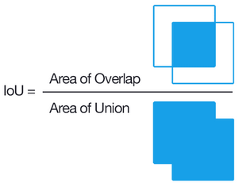
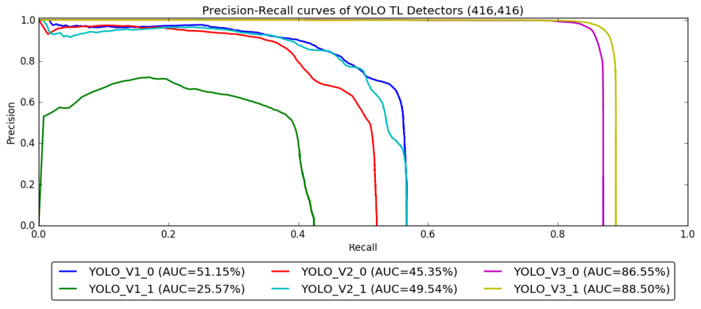
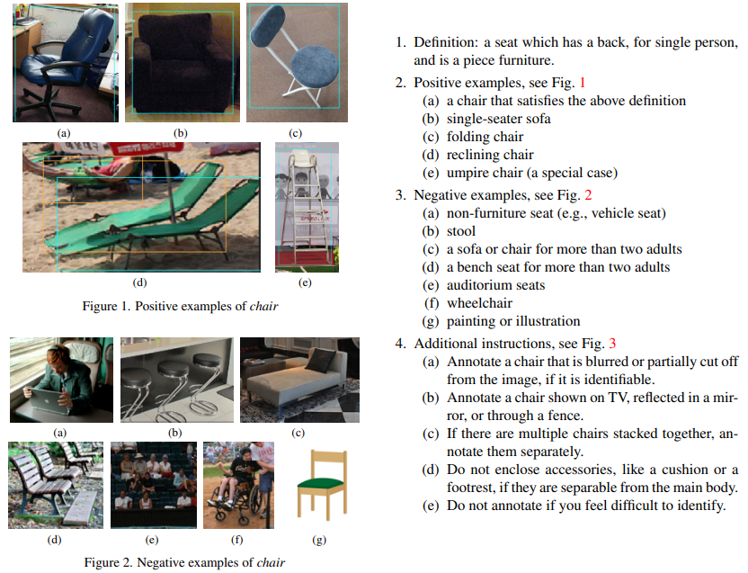

# Текст статьи

# MS COCO

Самый простой способ собрать датасет изображений для обучения моделей - поиск в интернете. Но если сделать поиск, скажем, по запросу "велосипед", то фотографии в поисковой выдаче будут содержать в основном велосипед в профиль, по центру изображения, ничем не загороженный и при нормальном освещении (то, что авторы называют "iconic view"). Если обучать нейронную сеть на таких изображениях, то она может не научиться распознавать велосипед в других, более типичных ситуациях: вдалеке, повернутый другой стороной или наполовину заслоненный. Поэтому для более надежного обучения и тестирования авторы собрали датасет, содержащий те или иные объекты в произвольных контекстах.

Microsoft COCO (Common Objects in Context, [Lin et al., 2014](https://arxiv.org/abs/1405.0312)) содержит 328 000 изображений, на которых отмечено 2.5 миллиона объектов 91 разных классов, из которых 82 класса представлены 5000 и более примерами.

Проблема разметки бокса и в целом задачи детекции
Метрика mAP50, mAP50:95

Согласно [Lin et al., 2014](https://arxiv.org/abs/1405.0312), в датасете MS COCO каждое изображение в среднем содержит 7.7 объектов, тогда как в ImageNet - 3.0 объекта, в PASCAL VOC - 2.3 объекта. Эти различия стоит учитывать, поскольку свойства современных моделей во многом зависят от статистик датасета, на котором они обучались (это не очень желательное свойство, но это реальность, с которой приходится считаться).

### Метрика mAP детектирования объектов

Целью моделей детекции является не только обнаружить, что объект "где-то есть" на изображении (как в случае классификации), но и указать его конкретного местоположение и размер. При этом высокая точность, как правило, не требуется, поскольку вряд ли имеет практический смысл идеально точно находить границы ограничивающего прямоугольника (если надо точно выделить объект, то для этого есть задача instance-сегментации). На этом основана распространенная метрика mAP50: в ней считается, что объект выделен верно, если предсказанный и эталонный бокс пересекаются более чем на 50%. Далее пошагово рассмотрим алгоритм подсчета этой метрики (этот раздел будет достаточно длинным, но сократить его без потери смысла не получается).

**Intersection over Union (IoU)** для двух боксов - это число, равное отношению площади пересечения боксов к площади их объединения. Данная метрика инвариантна к растяжению и сжатию по обеим осям, поэтому в ней не имеет значения, измеряются ли размеры боксов в пикселях или в процентах от всего изображения.

Метрика **AP50** предназначена для задачи одноклассового детектирования объектов. Зафиксируем некий класс и оставим эталонные и предсказанные боксы *только этого класса*. Каждому предсказанному боксу должно быть сопоставлено значение "уверенности" (confidence) - эти значения тоже выдает модель. Выберем некий порог confidence, и удалим все предсказанные боксы ниже этого порога. Далее все предсказания мы можем поделить на 4 класса:

1. **Истинно положительное предсказание (TP)**: пара из предсказанного бокса `B` и эталонного бокса `B*`, таких что `IoU(B, B*) > 0.5` (отсюда цифра 50 в названии метрики).
2. **Ложноположительное предсказание (FP)**: для некоего предсказанного бокса `B`  отсутствует соответствующий ему эталонный бокс с IoU между ними больше 0.5, то есть модель нашла то, чего на самом деле нет.
3. **Ложноотрицательное предсказание (FN)**: для некоего эталонного бокса `B`  отсутствует соответствующий ему предсказанный бокс с IoU между ними больше 0.5, то есть некий объект модель не смогла найти (или слишком сильно ошиблась в боксе.

В случае, если некий объект отмечен дважды, то одно из предсказаний считается истинным положительным, а другое ложноположительным.  Если же, например, у кота выделена только морда, то предсказанный бокс будет намного меньше эталонного, и IoU будет меньше 0.5, поэтому мы будем иметь одно ложноположительное и одно ложноотрицательное предсказание. Очевидно, понятие "истинно отрицательного предсказания" (TN) в случае детекции не имеет смысла, в отличие от задачи бинарной классификации.

> Нам нужно вспомнить понятия **precision** и **recall**. Понять их очень просто: представим, что на столе лежат черные и белые шарики, и мы посадили за стол робота, который отобрал себе кучку шариков, стараясь брать только черные, но сделал это неидеально. Посмотрим что у робота в руках (то есть какие шарики он отобрал). Доля черных шариков среди них - это precision: чем он выше, тем меньше белых шариков случайно взял робот. Теперь посмотрим какую долю черных шариков робот взял себе (из всех тех, что лежат на столе) - это recall: чем он выше, тем меньше черных шариков осталось не взято. Если precision и recall одновременно равны единице, то робот идеально отобрал все черные шарики, не взяв белых. Таким образом: Precision = TP/(TP + FP), recall = TP/(TP + FN).

> Теперь представим, что робот упорядочил шарики в линию слева направо по степени уверенности того, что шарик является черным. Он может выбрать порог разделения в любом месте линии, и взять себе все шарики справа от порога. Если качество классификации робота не слишком низко, но и не идеально, то двигаясь слева направо мы будем видеть, что черных шариков становится больше а белых меньше. Повышая порог, робот увеличивает precision: теперь он возьмет себе меньше шариков, но с большей гарантией. Понижая порог, робот увеличивает recall: теперь робот упустит меньше черных шариков, но precision будет меньше. Таким образом, это понятия-антагонисты: чем выше precision, тем обычно ниже recall и наоборот (хотя и не всегда).

> Варьируя порог и следя за изменением precision и recall, мы можем построить график PR (precision recall). Площадь под этим графиком - это метрика PR AUC (area under curve), применяемая для задач бинарной классификации. Поскольку для ее рассчета не требуется знать TN (true negative), то мы можем применить ее и в нашем случае.
 
Вернемся к задаче детекции. Мы зафиксировали класс и порог IoU (равный 50%). Для каждого значения порога confidence мы считаем precision и recall, строя график PR, и считаем площадь под ним (PC AUC). Так мы получаем метрику **AP50 (average precision)** для данного класса. Например, на изображении ниже приведены графики PR для распознавания светофоров шестью разными моделями ([Jensen et al., 2017](https://openaccess.thecvf.com/content_cvpr_2017_workshops/w9/papers/Jensen_Evaluating_State-Of-The-Art_Object_CVPR_2017_paper.pdf)).

Такие графики легко интерпретируются. Например, выберем модеь YOLO_V3_1 (желтый график), и настраиваем порог срабатывания так, чтобы recall был равен 0.85 (модель обрнаруживала 85% из всех светофоров), то precision будет равен 0.98 (то есть среди всех найденных моделью "светофоров" 2% будет другими объектами). Если же мы хотим recall равный 0.9 и выше, то наша модель достичь этого не может: около 10% светофоров модель не находит ни при каком пороге. На практике графики PR не всегда имеют столь резкое падение от 1 до 0, это зависит от задачи.

Осталось немногое. Усредняя AP50 по всем классам, получаем метрику **mAP50 (mean average precision)**. Здесь есть некий терминологический курьез: слова mean и average означают по сути одно и то же - "среднее", только "average" берется по значениям recall, а "mean" по классам. 

Наконец, считая mAP для каждого порога IoU от 50% до 95% и усредняя, мы получаем метрику **mAP50:95**. Какая из метрик лучше (mAP50, mAP50:95, mAP75 или еще какая-то) сказать в общем случае нельзя - это зависит от того, насколько точно требуется определять бокс. В конце концов, финальная метрика качества - это эффективность "в рублях" от внедрения системы (возможно также в числе предотвращенных аварий, в репутации, в количестве донатов на кофе и прочее), но посчитать эти величины непросто.

Метрика mAP имеет одну не очень приятную особенность: если некоторые классы похожи (например, собаки и кошки), и система найдет собаку, хотя в разметке указана кошка, то это будет считаться однозначной ошибкой (false positive в одном классе и false negative в другом), даже если бокс объекта указан точно. Но точность определения класса может являться второстепенной: например, в задаче автономного вождения автомобиля модель может перепутать пешехода со столбом или собаку с кошкой, но затормозить в обоих случаях. Поэтому важно не только считать метрику, но и интерпретировать ее (изучая графики и визуализацию ошибок). Тогда удастся отследить подобные проблемы и найти способ скоректировать метрику под ваш случай (например, объединить класс кошек и собак).

Можно также упомянуть статью [Bolya et al., 2020](https://arxiv.org/abs/2008.08115), в которой авторы описывают 6 типов ошибок моделей детекции: Classification Error, Localization Error, Both Cls and Loc Error, Duplicate Detection Error, Background Error, Missed GT Error. Для каждого типа ошибки пишут алгоритм ее нахождения, получая "error analysis toolbox", и с его помощью анализируют различные модели детекции. Это помогает как более детально понимать качество и склонности моделей, так и визуально находить ошибки в разметке датасетов.

### Что не так с детектированием объектов?

### Проблемы и ошибки аннотации в MS COCO

Как и другие датасеты, MS COCO неидеален и содержит ошибки аннотации. [Bolya et al., 2020](https://arxiv.org/abs/2008.08115) анализируют ошибки моделей детекции на тестовой части MS COCO и обнаруживают, что некоторые "ошибочные" детектирования (особенно те, в которых модель наиболее уверена) часто вызваны тем, что аннотаторы пропустили какой-то объект, а модель его нашла.

К такому же выводу приходит другая группа исследователей ([Ma et al., 2022](https://openaccess.thecvf.com/content/CVPR2022W/VDU/papers/Ma_The_Effect_of_Improving_Annotation_Quality_on_Object_Detection_Datasets_CVPRW_2022_paper.pdf)). Они выбирают 80 067 изображений 5 классов (car, chair, cup, person, traffic light) из датасета MS COCO и более тщательно их переразмечают, следуя набору строгих правил разметки (guidelines). Выясняется, что в новой разметке объектов значительно больше, чем в старой. Отчасти это связано с тем, что часть объектов была случайно пропущена в исходной разметке (missed ground truth). Но более значимо то, что новая и оригинальная разметка имеют и *систематические* отличия.

Например, в новой разметке старались отмечать каждого человека в толпе, тогда как в оригинальной разметке часто толпа людей часто была отмечена одним боксом, помеченным флагом "толпа". Также отличия между разметками возникали в сложных и пограничных случаях. Например, гайдлайн авторов предписывал отмечать как "стул" объекты на figure 1 и не отмечать как "стул" объекты на figure 2, а также отмечать стулья, показываемые на экране, отраженные в зеркале или сложенные. В исходной разметке инструкции на подобные случаи могли быть другими или вовсе отсутствовать. Очевидно, что для других классов могут существовать такие же или еще более сложные случаи.

После переразметки обучающей и тестовой части MS COCO можно обучать модель на старой либо новой разметке и тестировать на старой либо новой разметке, что в итоге дает 4 сценария тестирования. Иронично то, что наибольшей метрики при этом достигают модели, которые обучались и тестировались на оригинальной разметке.

В данном случае переразметка не только исправила ошибки, но и усложнила задачу. Например, модель, обученная на новой разметке, старается более тщательно выделять людей в толпе - это во-первых сложнее, чем обвести всю толпу как один объект, а во-вторых при тестировании на оригинальной разметке будет считаться ошибкой. То же самое касается и других систематических отличий старой и новой разметки. Тем не менее, можно предположить, что модели, обученные на новой разметке, имеют более высокое качество при применении по назначению.

## PASCAL VOC

PASCAL VOC challenge ([Everingham et al., 2010](https://homepages.inf.ed.ac.uk/ckiw/postscript/ijcv_voc09.pdf), [Everingham et al., 2014](http://host.robots.ox.ac.uk/pascal/VOC/pubs/everingham15.pdf)) - соревнование по детекции объектов и семантической сегментации изображений, проходившее ежегодно с 2005 по 2012 год. Скачать данные и посмотреть отличия между версиями разных лет можно на странице [PASCAL VOC project](http://host.robots.ox.ac.uk/pascal/VOC/). Две основные версии датасета - 2007 и 2012 годов.

| Версия          | Train+val size | Test size | N classes |
|-----------------|----------------|-----------|-----------|
| PASCAL VOC 2007 | 2501           | 4952      | 20        |
| PASCAL VOC 2012 |                |           |           |
Обе версии состоят из набора изображений, полученных с сайта Flickr по различным поисковым запросам. Они размечены для задачи детектирования объектов: авторы выбрали 20 классов, образующих иерархию классов. Для каждого класса на каждом изображении найдены все объекты данного класса и отмечены их ограничивающие прямоугольники (боксы). Боксы включают только видимые части объектов, при этом в аннотациях указано, является ли бокс обрезанным (из-за того, что часть объекта скрыта или выходит за границу изображения). Дополнительно для некоторых изображений отмечены маски семантической сегментации и отмечены части объектов.

Также в аннотациях отмечено, какие именно объекты являются "сложными" для распознавания с точки зрения аннотаторов. Такие объекты важно отмечать по той причине, что мы не должны "штрафовать" метрику качества за неправильную детекцию этих объектов: сами аннотаторы могли сделать в них ошибки. Если не отметить "сложные" объекты, то такой подход невозможен: любая детекция модели в данном участке будет считаться ложноположительной.

Интересный факт: PASCAL - это европейский [проект](http://www.pascal-network.org/), который расшифровывается как "*Pattern Analysis, Statistical Modelling and Computational Learning*". VOC означает "*Visual Object Classes*". Последний раз соревнование на этом датасете проходило в 2012 году, то есть еще до того, как к большим изображениям начали активно применяться нейронные сети ([Krizhevsky et al., 2012](https://proceedings.neurips.cc/paper/2012/file/c399862d3b9d6b76c8436e924a68c45b-Paper.pdf)). После 2012 года соревнование больше не проводилось, видимо, из-за смерти основателя проекта Mark Everingham. В 2014 году на смену пришел датасет MS COCO. И хотя датасет PASCAL VOC можно считать устаревшим, но используемый в нем формат аннотаций для детекции объектов активно используется до сих пор, поэтому полезно будет сравнить его с другими форматами.

### Формат аннотаций VOC, COCO и YOLO

В PASCAL VOC аннотации хранятся в формате **.xml** (один файл на одно изображение). Для сравнения, в MS COCO аннотации хранятся в формате **.json** (один файл на весь датасет), а [YOLOv5](https://github.com/ultralytics/yolov5) использует формат **.txt** (один файл на одно изображение) и **.yaml**-файл с названиями классов (один на весь датасет).

Существуют [инструменты](https://github.com/pylabel-project/pylabel) для конвертации аннотаций между этими тремя форматами, но между ними много существенных различий: например, VOC-формат (.xml) хранит классы объектов в виде строк, то есть классам не присвоены индексы и не указан какой-либо порядок классов. Это может привести к проблемам при конвертации между форматами: при одном запуске конвертации .xml в .txt-аннотации порядок получится один, при другом запуске - другой, и в результате в train и val выборках классы будут пронумерованы по-разному: метрика модели на валидации не будет расти, и сложно будет выявить причину.

## ImageNet

http://vision.stanford.edu/documents/Fei-FeiFergusPerona2006.pdf
https://en.wikipedia.org/wiki/ImageNet
https://image-net.org/static_files/papers/imagenet_cvpr09.pdf
https://arxiv.org/pdf/1409.0575.pdf
https://link.springer.com/content/pdf/10.1007/978-3-642-15555-0_6.pdf

## MNIST

Когда-то, на заре существования нейронных сетей, из космического хаоса появились Ян Лекун, разработанная им с коллегами нейронная сеть LeNet ([LeCun et al., 1989](http://yann.lecun.com/exdb/publis/pdf/lecun-89e.pdf)) и датасет MNIST ([LeCun et al., 1998](http://vision.stanford.edu/cs598_spring07/papers/Lecun98.pdf)). MNIST содержит 60 000 обучающих и 10 000 тестовых черно-белых изображений размером 28х28. Изображения содержат рукописные цифры, которые требуется распознать (задача классификации с 10 сбалансированными классами).

Цифры в MNIST расположены по центру изображения, поэтому задача относительно неплохо (90%) решается даже линейным классификатором. В таком классификаторе можно даже углядеть некую интерпретируемость: он содержит матрицу весов размером `(28*28, 10)`,  и если сделать reshape этой матрицы в массив размером `(28, 28, 10)`, взять подмассив `[..., i]` и визуализировать как изображение 28х28, то в нем можно увидеть очертания цифры с индексом `i`.

Современные сети распознают MNIST с [точностью около 99.8%](https://paperswithcode.com/sota/image-classification-on-mnist), их предсказания не совпадают с разметкой лишь в тех случаях, когда и человеку непонятна написанная цифра. Однако с современными задачами компьютерного зрения все это связано довольно слабо, поскольку датасет MNIST очень "рафинирован": в нем не требуется находить цифру на большом листе бумаги, отсутствуют шумы и искажения цвета, не варьируется масштаб цифры, отстутствуют посторонние изображения и так далее. Задача распознавания реального рукописного текста намного более сложная (например, часто отдельная буква непонятна, но слово в целом угадывается, из-за чего можно предположить что это за буква). Поэтому словосточетание "state-of-the-art на MNIST" сейчас воспринимается скорее с иронией.

Но как учебный датасет MNIST очень хорош. Несмотря на кажущуюся простоту задачи, не получается просто взять и написать через if-else хороший алгоритм распознавания цифр. Работа с MNIST заставляет задумываться о вопросах, которые в целом не решены до сих пор: как именно нейронные сети распознают изображения? И как это делает человек?

Сейчас на основе MNIST создано много похожих датасетов, в том числе:
- [EMNIST](https://www.kaggle.com/datasets/crawford/emnist) ([Cohen et al., 2017](https://arxiv.org/abs/1702.05373)), [Kannada-MNIST](https://www.v7labs.com/open-datasets/kannada-mnist), [Fashion MNIST](https://www.kaggle.com/datasets/zalando-research/fashionmnist) и другие варианты
- [MNIST-C](https://github.com/google-research/mnist-c) ([Mu and Gilmer, 2019](https://arxiv.org/abs/1906.02337)) вносит различные шумы и искажения для тестирования устойчивости к сдвигу данных (когда модели обучаются в одних условиях, а тестируются в других)
- [Sequential MNIST](https://paperswithcode.com/sota/sequential-image-classification-on-sequential) - по сути это оригинальный MNIST, но решаемый с помощью [RNN](https://ru.wikipedia.org/wiki/%D0%A0%D0%B5%D0%BA%D1%83%D1%80%D1%80%D0%B5%D0%BD%D1%82%D0%BD%D0%B0%D1%8F_%D0%BD%D0%B5%D0%B9%D1%80%D0%BE%D0%BD%D0%BD%D0%B0%D1%8F_%D1%81%D0%B5%D1%82%D1%8C).
- Автор этой статьи некогда создавал учебный датасет [Captcha Recognition](https://www.kaggle.com/competitions/sf-captcha-recognition/overview).
# Датасеты

! [Language-driven Semantic Segmentation](https://paperswithcode.com/paper/language-driven-semantic-segmentation-1)

!! **Meta-Dataset**: ([Triantafillou et al., 2019](https://arxiv.org/abs/1903.03096)) Meta-Dataset: A Dataset of Datasets for Learning to Learn from Few Examples

**ImageNet**: ([Deng et al., 2009](https://image-net.org/static_files/papers/imagenet_cvpr09.pdf)) Imagenet: A large-scale hierarchical image database. ([Russakovsky et al., 2014](https://arxiv.org/abs/1409.0575)) ImageNet Large Scale Visual Recognition Challenge. См также: [ImageNet-C](https://paperswithcode.com/dataset/imagenet-c), [ImageNet-R](https://paperswithcode.com/dataset/imagenet-r), [ImageNet-A](https://paperswithcode.com/dataset/imagenet-a), [ImageNet-Sketch](https://paperswithcode.com/dataset/imagenet-sketch), [mini-Imagenet](https://paperswithcode.com/dataset/mini-imagenet).

ImageNet ([Deng et al., 2009](https://image-net.org/static_files/papers/imagenet_cvpr09.pdf), [Russakovsky et al., 2014](https://arxiv.org/abs/1409.0575))

**Pascal VOC**: ([Everingham et al., 2015](https://homepages.inf.ed.ac.uk/ckiw/postscript/ijcv_voc09.pdf)) The PASCAL Visual Object Classes Challenge: A Retrospective. См. также [PASCAL Context](https://paperswithcode.com/dataset/pascal-context), [ScribbleSup](https://paperswithcode.com/dataset/scribblesup).

**MS COCO**: ([Lin et al., 2014](https://arxiv.org/abs/1405.0312)) Microsoft COCO: Common Objects in Context. См. также: [COCO-stuff](https://paperswithcode.com/dataset/coco-stuff), [COCO reannotation](https://openaccess.thecvf.com/content/CVPR2022W/VDU/papers/Ma_The_Effect_of_Improving_Annotation_Quality_on_Object_Detection_Datasets_CVPRW_2022_paper.pdf).

**LAION-5B**: ([Schuhmann et al., 2022](https://arxiv.org/abs/2210.08402)) LAION-5B: An open large-scale dataset for training next generation image-text models

**JFT-300M**: ([Sun et al., 2017](https://arxiv.org/abs/1707.02968)) Revisiting Unreasonable Effectiveness of Data in Deep Learning 

**Tiny Images**, **CIFAR-10** и **CIFAR-100**: ([Krizhevsky, 2009](https://www.cs.toronto.edu/~kriz/learning-features-2009-TR.pdf)) Learning Multiple Layers of Features from Tiny Images (см. также [здесь](http://groups.csail.mit.edu/vision/TinyImages/))

**MNIST**: ([LeCun et al., 1998](http://vision.stanford.edu/cs598_spring07/papers/Lecun98.pdf)) Gradient-based learning applied to document recognition

**Cityscapes**: ([Cordts et al., 2016](https://arxiv.org/abs/1604.01685)) The Cityscapes Dataset for Semantic Urban Scene Understanding
Семантическая сегментация и instance-сегментация городских сцен.

**DomainNet**: ([Peng et al., 2018](https://arxiv.org/abs/1812.01754)) Moment Matching for Multi-Source Domain Adaptation

**PACS (Photo-Art-Cartoon-Sketch)**: ([Li et al., 2017](https://arxiv.org/abs/1710.03077)) Deeper, Broader and Artier Domain Generalization

**ADE20K**: ([Zhou et al., 2017](https://people.csail.mit.edu/bzhou/publication/scene-parse-camera-ready.pdf)) Scene Parsing through ADE20K Dataset
Датасет для задачи сегментации: выделены объекты и их части. Постановки задачи: scene parsing, semantic segmentation, instance segmentation, panoptic segmentation.

**Office-31**: ([Saenko et al., 2010](https://people.bu.edu/bkulis/pubs/saenko_eccv_2010.pdf)) Adapting Visual Category Models to New Domains
Доменная адаптация между 3 доменами: объекты без фона, компьютерная графика и фотографии.

**ScanNet**: ([Dai et al., 2017](https://arxiv.org/abs/1702.04405)) ScanNet: Richly-annotated 3D Reconstructions of Indoor Scenes

**SUN RGB-D**: ([Song et al., 2015](https://openaccess.thecvf.com/content_cvpr_2015/papers/Song_SUN_RGB-D_A_2015_CVPR_paper.pdf)) SUN RGB-D: A RGB-D Scene Understanding Benchmark Suite
Задача трехмерного понимания сцены: трехмерные аннотации.

**DAVIS 2017**: ([Pont-Tuset et al., 2017](https://arxiv.org/abs/1704.00675)) The 2017 DAVIS Challenge on Video Object Segmentation

**SODA10M**: ([Han et al., 2021](https://arxiv.org/abs/2106.11118)) SODA10M: A Large-Scale 2D Self/Semi-Supervised Object Detection Dataset for Autonomous Driving

Visual genome: ()

**ReferItGame**: ([Kazemzadeh et al., 2014](https://aclanthology.org/D14-1086.pdf)) ReferItGame: Referring to Objects in Photographs of Natural Scenes

**Objects365**: ([Shao et al., 2019](https://openaccess.thecvf.com/content_ICCV_2019/papers/Shao_Objects365_A_Large-Scale_High-Quality_Dataset_for_Object_Detection_ICCV_2019_paper.pdf)) Objects365: A Large-Scale, High-Quality Dataset for Object Detection

**Google Open Images**: ([Benenson and Ferrari, 2022](https://arxiv.org/abs/2210.14142)) From colouring-in to pointillism: revisiting semantic segmentation supervision (данная работа относится только к версии v7)

**DADA-seg**: ([Zhang et al., 2021](https://arxiv.org/abs/2112.05006)) Exploring Event-driven Dynamic Context for Accident Scene Segmentation

**Dark Zurich**: ([Sakaridis et al., 2019](https://arxiv.org/abs/1901.05946)) Guided Curriculum Model Adaptation and Uncertainty-Aware Evaluation for Semantic Nighttime Image Segmentation

**LVIS**: ([Gupta et al., 2019](https://arxiv.org/abs/1908.03195)) LVIS: A Dataset for Large Vocabulary Instance Segmentation

**DOTA**: ([Xia et al., 2017)](https://arxiv.org/abs/1711.10398) DOTA: A Large-scale Dataset for Object Detection in Aerial Images

FSOD (Few-Shot Object Detection Dataset): ([Fan et al., 2019](https://arxiv.org/abs/1908.01998)) Few-Shot Object Detection with Attention-RPN and Multi-Relation Detector

**WALT (Watch and Learn TimeLapse Images)**: ([Dinesh Reddy et al., 2022](https://openaccess.thecvf.com/content/CVPR2022/papers/Reddy_WALT_Watch_and_Learn_2D_Amodal_Representation_From_Time-Lapse_Imagery_CVPR_2022_paper.pdf)) WALT: Watch and Learn 2D Amodal Representation From Time-Lapse Imagery

**SKU110K**: ([Goldman et al., 2019](https://arxiv.org/abs/1904.00853)) Precise Detection in Densely Packed Scenes

[Dirichlet Mini-Imagenet](https://paperswithcode.com/sota/few-shot-image-classification-on-dirichlet)

[Amodal Panoptic Segmentation](https://paperswithcode.com/task/amodal-panoptic-segmentation)

[Zero-Shot Object Detection](https://paperswithcode.com/task/zero-shot-object-detection)

[Zero-Shot Instance Segmentation](https://paperswithcode.com/paper/zero-shot-instance-segmentation)

[Amodal Human Perception](https://paperswithcode.com/dataset/ahp)

[Perception Test](https://paperswithcode.com/dataset/perception-test)

[Handwriting Recognition](https://paperswithcode.com/task/handwriting-recognition)

[Image Outpainting](https://paperswithcode.com/task/image-outpainting)

[Image Inpainting](https://paperswithcode.com/task/image-inpainting)

[Video Inpainting](https://paperswithcode.com/task/video-inpainting)

[Image Super-Resolution](https://paperswithcode.com/task/image-super-resolution)

[Video Super-Resolution](https://paperswithcode.com/task/video-super-resolution)

**GOT-10k**: ([Huang et al., 2018](https://arxiv.org/abs/1810.11981)) GOT-10k: A Large High-Diversity Benchmark for Generic Object Tracking in the Wild

**LaSOT**: ([Fan et al., 2018](https://arxiv.org/abs/1809.07845)) LaSOT: A High-quality Benchmark for Large-scale Single Object Tracking

**CLEVR**: ([Johnson et al., 2016](https://arxiv.org/abs/1612.06890)) CLEVR: A Diagnostic Dataset for Compositional Language and Elementary Visual Reasoning

**VQA v2.0**: ([Goyal et al., 2016](https://arxiv.org/abs/1612.00837)) Making the V in VQA Matter: Elevating the Role of Image Understanding in Visual Question Answering

**NLVR**: ([Suhr et al., 2017](https://aclanthology.org/P17-2034.pdf)) A Corpus of Natural Language for Visual Reasoning

**Winoground**: ([Thrush et al., 2022](https://arxiv.org/abs/2204.03162)) Winoground: Probing Vision and Language Models for Visio-Linguistic Compositionality

**Human3.6M**: ([Ionescu et al., 2014](http://vision.imar.ro/human3.6m/pami-h36m.pdf)) Human3.6M: Large Scale Datasets and Predictive Methods for 3D Human Sensing in Natural Environments

**Charades**: ([Sigurdsson et al., 2016](https://arxiv.org/abs/1604.01753)) Hollywood in Homes: Crowdsourcing Data Collection for Activity Understanding. См. также [Charades-STA](https://paperswithcode.com/dataset/charades-sta).

**CUB-200-2011**: ([Wah et al., 2011](https://authors.library.caltech.edu/27452/1/CUB_200_2011.pdf)) The Caltech-UCSD Birds-200-2011 Dataset

**Market-1501**: ([Zheng et al., 2015](https://openaccess.thecvf.com/content_iccv_2015/papers/Zheng_Scalable_Person_Re-Identification_ICCV_2015_paper.pdf)) Scalable Person Re-identification: A Benchmark

**LFW**: ([Huang et al., 2008](http://vis-www.cs.umass.edu/lfw/lfw.pdf)) Labeled Faces in the Wild: A Database for Studying
Face Recognition in Unconstrained Environments